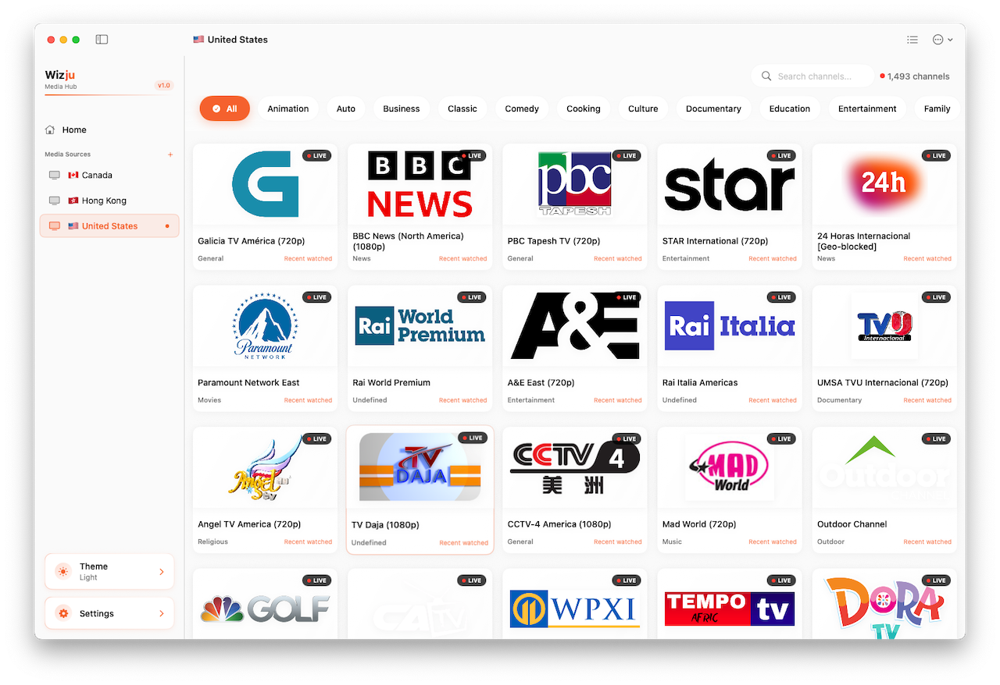
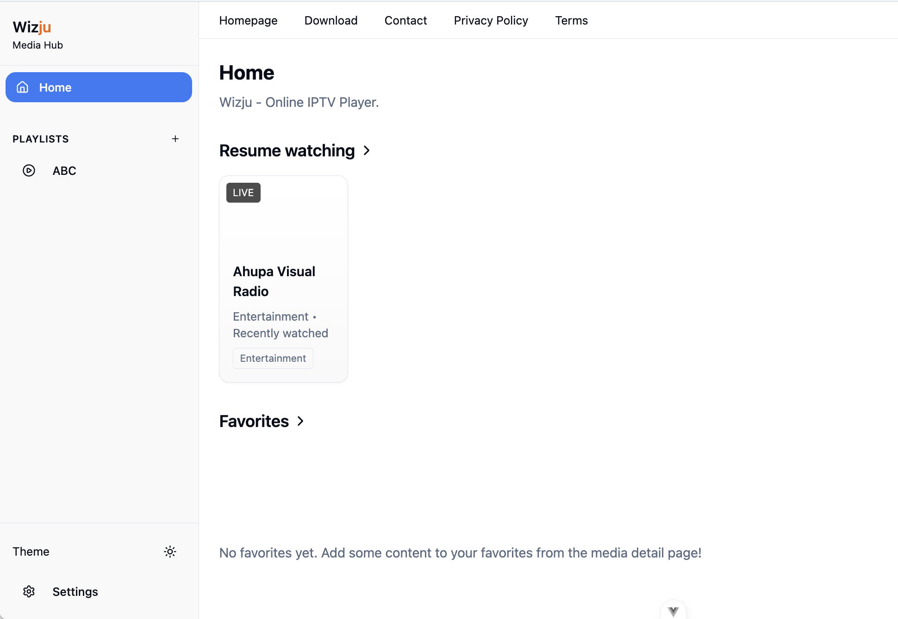
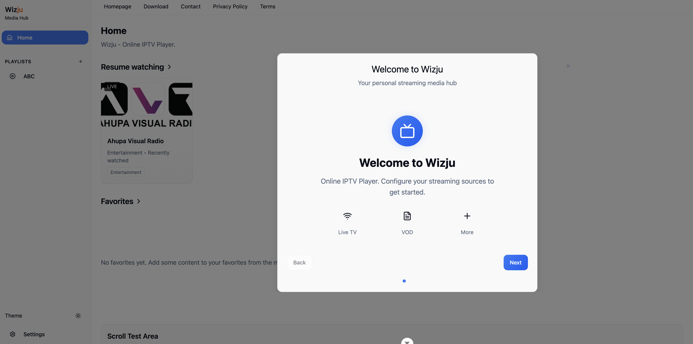
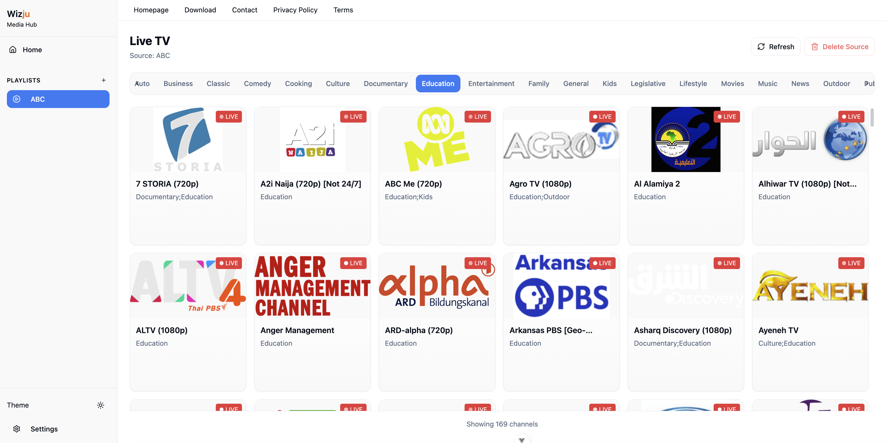

<div align="center">



# Wizju IPTV Player

Lightweight, modern, browser‑based IPTV player built with Vue 3, Vite, TypeScript, Pinia, TailwindCSS and Video.js.

[](https://vuejs.org)
[](https://vitejs.dev)
[](https://www.typescriptlang.org/)
[](#license)
[](https://eslint.org)

</div>

## ✨ Features

- 📺 Parse and load remote M3U playlists (live channels) via `iptv-playlist-parser`
- 🗂 Automatic category extraction & tagging
- ⭐ Local favorites management (up to 20, persisted in `localStorage`)
- 🕒 Recently watched list with time‑ago and last play position
- ▶️ Video playback powered by Video.js + HTTP streaming plugin
- 🧭 Route guarding & simple navigation service
- ⚡ Virtualized grids & large list rendering demos (`VirtualScrollDemo`)
- 🎨 Themeable Tailwind CSS design with ready‑made theme styles
- 🔍 Hash‑based routing (no server config needed)
- 🧪 Strict TypeScript + `vue-tsc` type build step
- 🧰 ESLint + Prettier configured for consistent code style

## 📸 Preview


| Home                               | Live Channels                            | Live Channels                      |
| ---------------------------------- | ---------------------------------------- | ---------------------------------- |
|  |  |  |

## 🧱 Architecture Overview

```
src/
	assets/                Static assets & theme css
	components/            Reusable UI + domain components
		media/               Media grids, cards, sections
		navigation/          Sidebar & navigation controls
		setup/               First‑time setup flows
		ui/                  Generic UI primitives (Button, Card, etc.)
	services/              Local domain logic (parsing, favorites, recent)
	stores/                Pinia stores (stream sources, media items, theme)
	router/                Route definitions & guards
	views/                 Page‑level route components
	hooks/                 Composables (e.g. responsive grid)
	types/                 Shared TypeScript types
	utils/                 Utility helpers (cn, virtual scroll debug)
```

Key flows:

- An M3U URL is provided -> `MediaParsingService` fetches & parses -> categories extracted -> stored via `streamSources` store & related services.
- Playback & navigation use the Pinia stores + router guard to ensure a playlist is loaded before entering detail pages.
- Favorites & recently watched are persisted in `localStorage` (services: `favoritesService`, `recentWatchingService`).

## 🚀 Quick Start

Prerequisites:

- Node.js 20.19+ (or 22.12+)
- pnpm (recommended) – install globally if needed: `npm i -g pnpm`

Install dependencies:

```sh
pnpm install
```

Start development server (hot reload):

```sh
pnpm dev
```

Open: http://localhost:5173 (default Vite port – adjust if changed in your environment).

Type check + production build:

```sh
pnpm build
```

Run linter (auto‑fix):

```sh
pnpm lint
```

Format source (Prettier):

```sh
pnpm format
```

## 📝 Usage Guide

1. Launch the dev server.
2. Add an IPTV M3U playlist URL (HTTP/HTTPS) in the setup / add source flow.
3. Select active sources; categories will auto‑populate.
4. Open a media item to play. Favorites or recent history will update as you interact.
5. Use the theme toggle (if enabled) or customize Tailwind theme files under `assets/tailwind-themes`.

### Supported Playlist Format

Standard extended M3U with `#EXTINF` entries. Logos (`tvg-logo`), names (`tvg-name`), and group titles are consumed for rich cards.

## 🌐 Free Public IPTV Playlists (iptv-org)

You can obtain free, community‑maintained IPTV channel playlists from the excellent open‑source project **[iptv-org/iptv](https://github.com/iptv-org/iptv)**. These playlists are aggregated from publicly available sources.

Common playlist endpoints (use any of these URLs directly when adding a source in the app):

| Purpose                             | URL                                                     |
| ----------------------------------- | ------------------------------------------------------- |
| All channels                        | `https://iptv-org.github.io/iptv/index.m3u`             |
| By country (example: China)         | `https://iptv-org.github.io/iptv/countries/cn.m3u`      |
| By country (example: United States) | `https://iptv-org.github.io/iptv/countries/us.m3u`      |
| By category (Movies)                | `https://iptv-org.github.io/iptv/categories/movies.m3u` |
| By category (News)                  | `https://iptv-org.github.io/iptv/categories/news.m3u`   |
| By language (English)               | `https://iptv-org.github.io/iptv/languages/eng.m3u`     |
| By language (Spanish)               | `https://iptv-org.github.io/iptv/languages/spa.m3u`     |

More filtering / variants are documented in the iptv-org repo README (e.g. excluding offline channels, selecting specific resolution, etc.).

### How to Use

1. Copy one of the playlist URLs above (or from the iptv-org repo).
2. In this app, use the Add Source / Setup screen and paste the URL.
3. The app will fetch & parse the playlist; categories will be auto‑extracted.
4. Start browsing the Live view once parsing completes.

### Notes & Disclaimer

- All content is provided by third‑party sources; this project does not host or guarantee streams.
- Use only for personal, non‑commercial purposes and comply with local laws.
- If a playlist is very large, initial parsing may take a few seconds in the browser.

If a URL fails to load, check your network / CORS restrictions or try a smaller country/category list.

## 🧪 Testing (Manual for now)

Currently there are no automated tests. Suggested next steps:

- Add Vitest + @vue/test-utils for component tests
- Add parsing service unit tests with sample M3U fixtures

## 📦 Deployment

Any static host (Netlify, Vercel, GitHub Pages, Cloudflare Pages) can serve the production `dist/` output. Because the router uses hash mode, no server rewrite rules are required.

Basic flow:

```sh
pnpm build
# upload dist/ contents to your static host
```

## 🔧 Configuration

Environment variables (if you add them later) can be defined in `env.d.ts` / `.env` files per Vite conventions. For Google Analytics the code references `gtag` globally; inject your tag snippet in `index.html` if desired.

Tailwind customization: edit `tailwind.config.ts` and theme CSS in `src/assets/tailwind-themes/`.

## 🧩 Code Style

- ESLint + `eslint.config.ts`
- Prettier formatting (run `pnpm format`)
- Strict TypeScript, incremental builds via `vue-tsc`

## 🤝 Contributing

Contributions are welcome! Typical workflow:

1. Fork & clone
2. Create a feature branch: `git checkout -b feat/short-description`
3. Install deps: `pnpm install`
4. Implement & ensure `pnpm lint` passes
5. Open a Pull Request describing changes + screenshots if UI related

Please keep PRs focused and small where practical.

## 🛡 Security

No server side component: all parsing is client‑side. Be mindful that arbitrary playlist URLs are fetched by the client browser (CORS restrictions apply). Do not paste private playlists on shared/public deployments.

## 🐛 Issue Reporting

Use GitHub Issues. Provide:

- Description & reproduction steps
- Playlist sample (if possible)
- Browser & OS details
- Console errors (copy/paste)

## 📄 License

MIT License.

## 🙌 Acknowledgements

- [Vue 3](https://vuejs.org)
- [Vite](https://vitejs.dev)
- [Tailwind CSS](https://tailwindcss.com)
- [Video.js](https://videojs.com)
- [Wizju.com online-player](https://wizju.com/iptv-online-player/)
